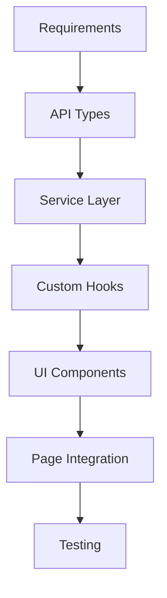

# Project Documentation

This folder contains comprehensive documentation for the Event Management Dashboard project.

## 📁 Documentation Structure

### [`/core/`](core/) - Essential System Documentation
Core architecture and standards that every developer should know.

- **[TEAM_STANDARDS.md](core/TEAM_STANDARDS.md)** - Official development standards and patterns
- **[AUTH_PROTECTION_GUIDE.md](core/AUTH_PROTECTION_GUIDE.md)** - Authentication system usage
- **[HYDRATION_GUIDE.md](core/HYDRATION_GUIDE.md)** - SSR hydration patterns
- **[API_ARCHITECTURE.md](core/API_ARCHITECTURE.md)** - API layer design
- **[FOLDER_STRUCTURE.md](core/FOLDER_STRUCTURE.md)** - Project organization

### [`/patterns/`](patterns/) - Reusable Patterns
Proven patterns and architectures for consistent development.

- **[ENTERPRISE_COMPONENT_ARCHITECTURE.md](patterns/ENTERPRISE_COMPONENT_ARCHITECTURE.md)** - Component design patterns

### [`/guides/`](guides/) - Step-by-Step Guides
Detailed guides for specific development tasks.

- **[QUICK_START.md](guides/QUICK_START.md)** - Get started quickly
- **[DEVELOPMENT_FLOW.md](guides/DEVELOPMENT_FLOW.md)** - Complete development workflow
- **[BEST_PRACTICES.md](guides/BEST_PRACTICES.md)** - Coding standards and practices
- **[METADATA_BLUEPRINT.md](guides/METADATA_BLUEPRINT.md)** - SEO metadata implementation

### [`/reference/`](reference/) - Quick Reference
Quick lookups and examples for daily development.

- **[METADATA_QUICK_REFERENCE.md](reference/METADATA_QUICK_REFERENCE.md)** - Copy-paste metadata templates
- **[METADATA_EXAMPLES.md](reference/METADATA_EXAMPLES.md)** - Real-world metadata examples
- **[COMPONENT_EXAMPLES.md](reference/COMPONENT_EXAMPLES.md)** - Component implementation examples

## 🚀 Quick Navigation

### For New Developers
1. Start with [QUICK_START.md](guides/QUICK_START.md)
2. Review [TEAM_STANDARDS.md](core/TEAM_STANDARDS.md)
3. Follow [DEVELOPMENT_FLOW.md](guides/DEVELOPMENT_FLOW.md)

### For Feature Development
1. Check [TEAM_STANDARDS.md](core/TEAM_STANDARDS.md) for patterns
2. Use [COMPONENT_EXAMPLES.md](reference/COMPONENT_EXAMPLES.md) for reference
3. Follow [ENTERPRISE_COMPONENT_ARCHITECTURE.md](patterns/ENTERPRISE_COMPONENT_ARCHITECTURE.md)

### For Authentication
1. Read [AUTH_PROTECTION_GUIDE.md](core/AUTH_PROTECTION_GUIDE.md)
2. Understand [HYDRATION_GUIDE.md](core/HYDRATION_GUIDE.md)

### For SEO/Metadata
1. Quick start: [METADATA_QUICK_REFERENCE.md](reference/METADATA_QUICK_REFERENCE.md)
2. Complete guide: [METADATA_BLUEPRINT.md](guides/METADATA_BLUEPRINT.md)
3. Examples: [METADATA_EXAMPLES.md](reference/METADATA_EXAMPLES.md)

### For Architecture Understanding
1. Review [API_ARCHITECTURE.md](core/API_ARCHITECTURE.md)
2. Study [FOLDER_STRUCTURE.md](core/FOLDER_STRUCTURE.md)
3. Follow [TEAM_STANDARDS.md](core/TEAM_STANDARDS.md)

## 🔧 Development Workflow Summary

## � Documentation Principles

### ✅ What We Keep
- **Team standards** - Official patterns everyone follows
- **Core system guides** - Authentication, hydration, API architecture
- **Reusable patterns** - Component architecture, development workflows
- **Quick references** - Copy-paste examples and templates

### ❌ What We Remove
- Implementation status documents
- Module-specific integration details
- Duplicate content
- Outdated fix documentation
- Analysis documents (decisions already made)

## 🔧 Maintenance

### Adding New Documentation
- **Core systems**: Add to `/core/`
- **Reusable patterns**: Add to `/patterns/`
- **Step-by-step guides**: Add to `/guides/`
- **Quick references**: Add to `/reference/`

### Documentation Standards
- Clear, actionable content
- Copy-paste examples
- Organized by use case
- Regular cleanup of outdated content

## 📞 Support

- **Getting Started**: Check `/guides/` for step-by-step instructions
- **Daily Development**: Use `/reference/` for quick lookups and examples
- **Architecture Questions**: Review `/core/` for system understanding
- **Pattern Implementation**: Follow `/patterns/` for proven approaches

---

**Last Updated**: October 2025  
**Status**: Organized and Current  
**Total Files**: 12 essential documents

Happy coding! 🎉
