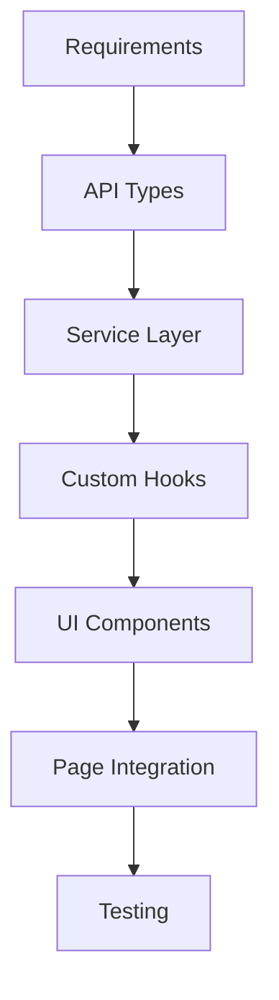

# Project Documentation

This folder contains comprehensive documentation for the E-commerce Dashboard project.

## 📁 Documentation Structure

### `/guides/`
Step-by-step guides for development workflows and best practices.

- **[DEVELOPMENT_FLOW.md](./guides/DEVELOPMENT_FLOW.md)** - Complete guide from UI creation to API integration
- **[DEVELOPMENT_FLOW_DIAGRAM.md](./guides/DEVELOPMENT_FLOW_DIAGRAM.md)** - Visual flow diagrams for development process
- **[QUICK_START.md](./guides/QUICK_START.md)** - Get started quickly with the project
- **[BEST_PRACTICES.md](./guides/BEST_PRACTICES.md)** - Coding standards and patterns

### `/architecture/`
Technical architecture documentation and design decisions.

- **[API_ARCHITECTURE.md](./architecture/API_ARCHITECTURE.md)** - API layer architecture and patterns
- **[AUTH_SYSTEM.md](./architecture/AUTH_SYSTEM.md)** - Authentication system design
- **[FOLDER_STRUCTURE.md](./architecture/FOLDER_STRUCTURE.md)** - Project organization

### `/examples/`
Real-world examples and code samples.

- **[COMPONENT_EXAMPLES.md](./examples/COMPONENT_EXAMPLES.md)** - Component implementation examples
- **[API_EXAMPLES.md](./examples/API_EXAMPLES.md)** - API integration examples

### Metadata System Documentation
Complete guides for implementing SEO-friendly metadata.

- **[METADATA_BLUEPRINT.md](./METADATA_BLUEPRINT.md)** - Complete metadata implementation guide
- **[METADATA_QUICK_REFERENCE.md](./METADATA_QUICK_REFERENCE.md)** - Quick reference and templates
- **[METADATA_EXAMPLES.md](./METADATA_EXAMPLES.md)** - Real-world implementation examples

## 🚀 Quick Navigation

### For New Developers
1. Start with [QUICK_START.md](./guides/QUICK_START.md)
2. Read [DEVELOPMENT_FLOW.md](./guides/DEVELOPMENT_FLOW.md)
3. Review [BEST_PRACTICES.md](./guides/BEST_PRACTICES.md)

### For Feature Development
1. Follow [DEVELOPMENT_FLOW.md](./guides/DEVELOPMENT_FLOW.md)
2. Reference [COMPONENT_EXAMPLES.md](./examples/COMPONENT_EXAMPLES.md)
3. Check [API_EXAMPLES.md](./examples/API_EXAMPLES.md)

### For Adding Metadata to Pages
1. Quick start: [METADATA_QUICK_REFERENCE.md](./METADATA_QUICK_REFERENCE.md)
2. Complete guide: [METADATA_BLUEPRINT.md](./METADATA_BLUEPRINT.md)
3. Real examples: [METADATA_EXAMPLES.md](./METADATA_EXAMPLES.md)

### For Architecture Understanding
1. Review [API_ARCHITECTURE.md](./architecture/API_ARCHITECTURE.md)
2. Understand [AUTH_SYSTEM.md](./architecture/AUTH_SYSTEM.md)
3. Study [FOLDER_STRUCTURE.md](./architecture/FOLDER_STRUCTURE.md)

## 🔧 Development Workflow Summary



## 📚 Key Patterns

### API Integration
```typescript
// 1. Define types
interface ApiRequest { /* ... */ }

// 2. Create service
class FeatureService extends BaseApiService { /* ... */ }

// 3. Create hooks
export const useFeature = () => { /* ... */ }

// 4. Use in components
const { data, isLoading, error } = useFeature();
```

### Error Handling
```typescript
// Always handle errors consistently
try {
  const result = await apiCall();
  return result;
} catch (error) {
  logger.error("Operation failed", error);
  throw error;
}
```

### Logging
```typescript
// Use structured logging
const logger = createLogger("COMPONENT_NAME");
logger.info("Operation started", { params });
```

## 📞 Support

- Check the guides for step-by-step instructions
- Review examples for implementation patterns
- Follow the architecture docs for understanding the system design

Happy coding! 🎉
