# Development Flow Diagram

This document provides visual flow diagrams for the development process from UI creation to API integration.

## 🎯 Complete Development Flow

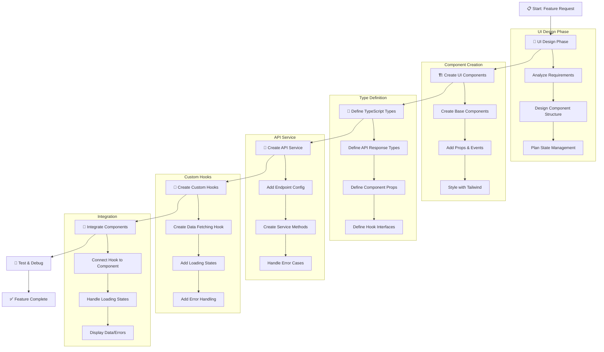

## 🏗️ Component Creation Flow

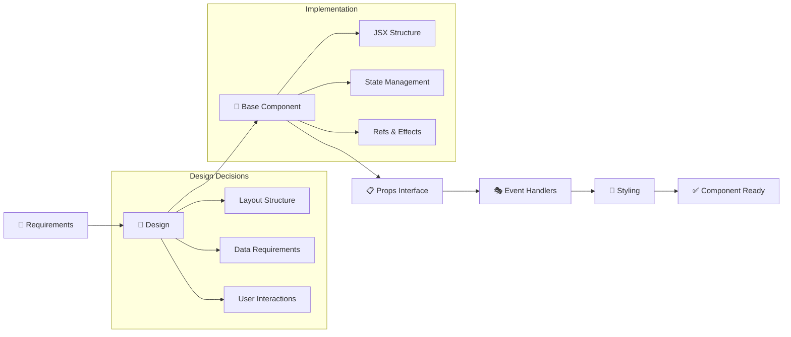

## 🔌 API Integration Flow

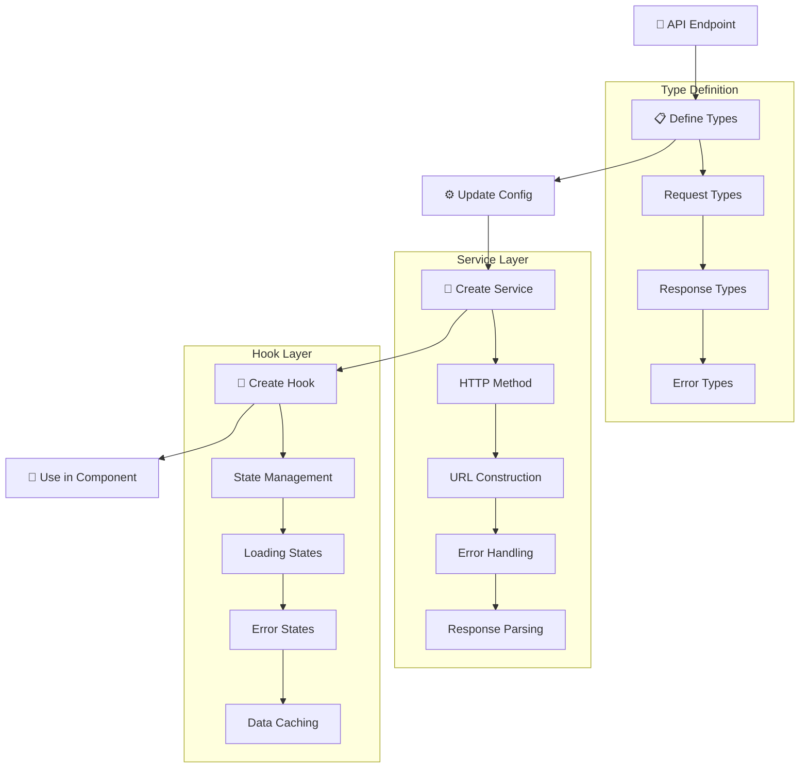

## 🎣 Hook Creation Pattern

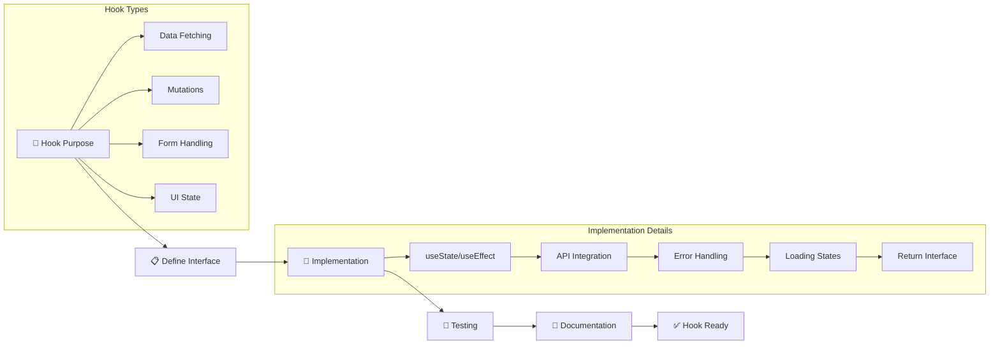

## 🔄 State Management Flow

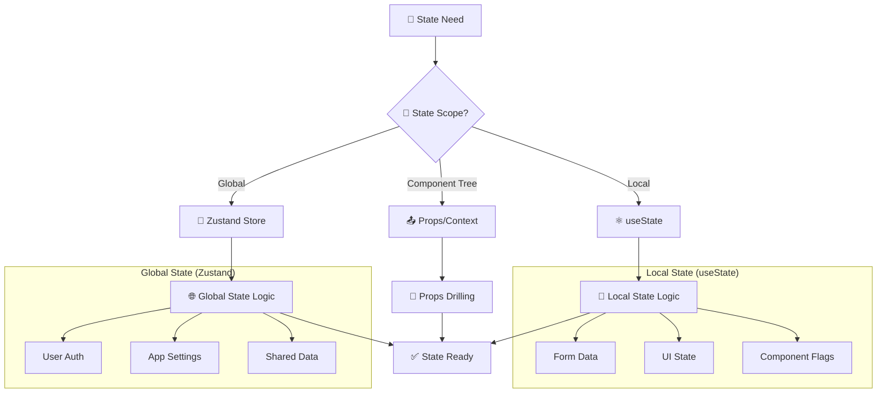

## 🧪 Testing Flow

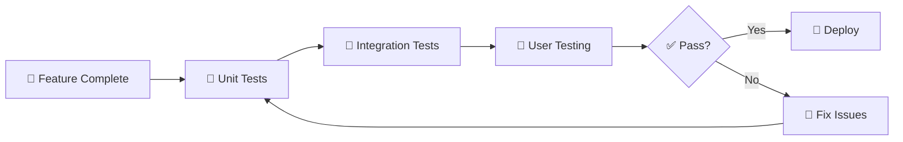

## 📂 File Organization Flow

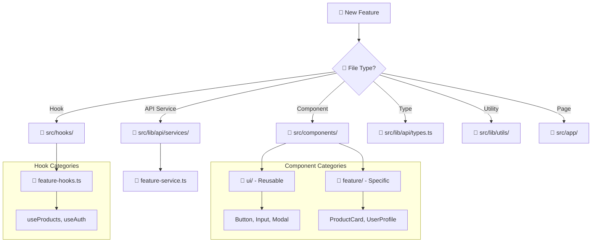

## 🚀 Real Example: Adding Products Feature

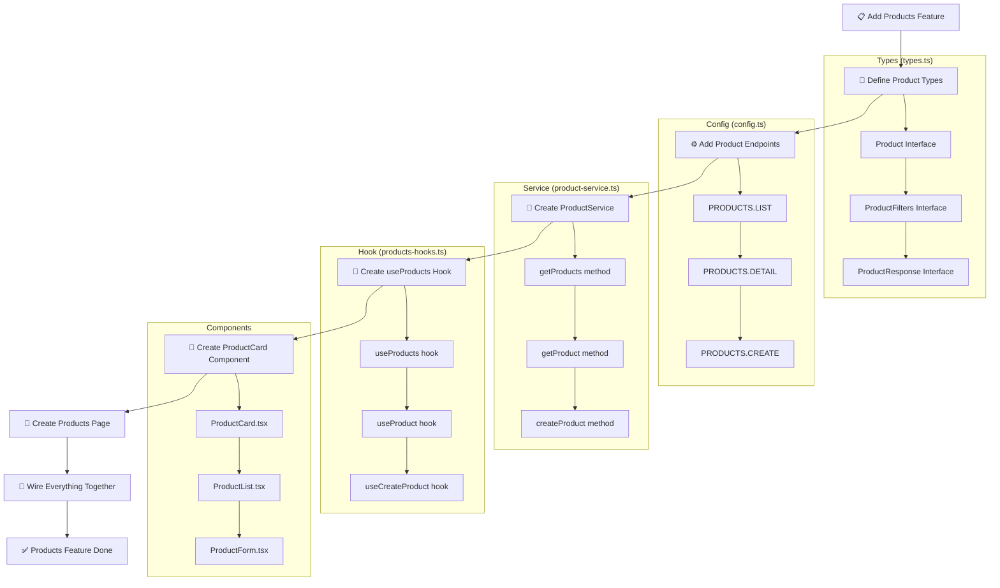

## 🔄 Error Handling Flow

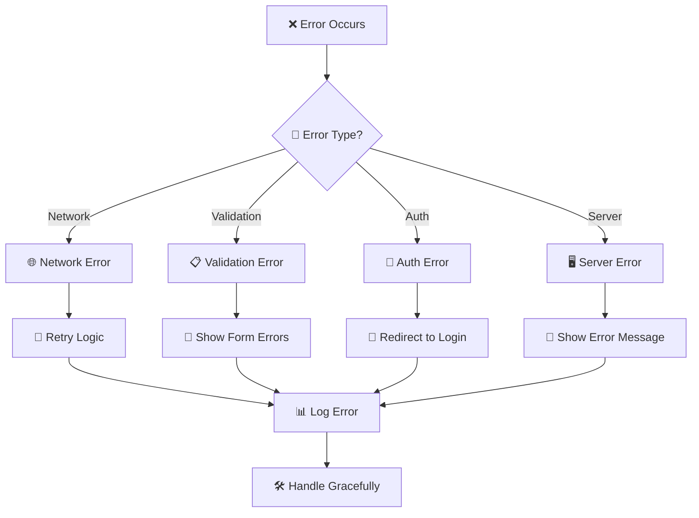

## 🎯 Best Practices Checklist

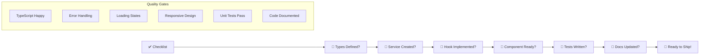

## 📱 Responsive Design Flow

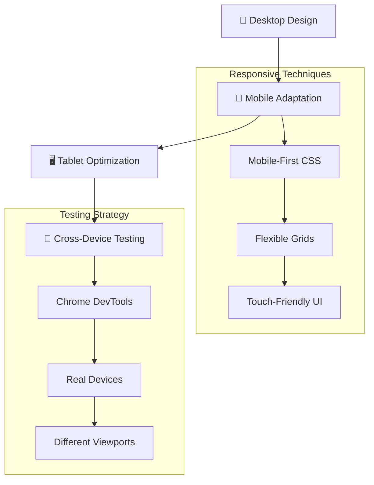

## 🔍 Debug Flow

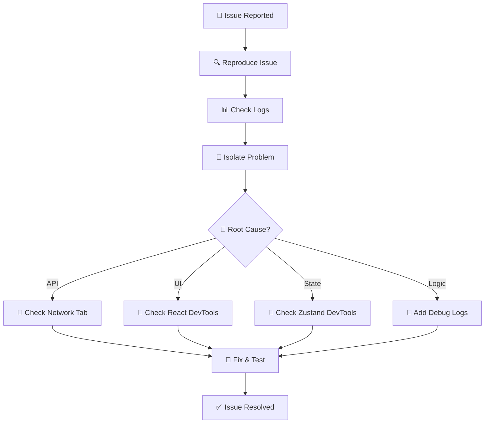

These diagrams provide a visual representation of the development workflow. You can use them as a reference when implementing new features, following the established patterns from UI creation through API integration.

## 🛠️ Tools for Viewing Diagrams

These diagrams use [Mermaid](https://mermaid.js.org/) syntax and can be viewed in:

- **GitHub** (native support)
- **VS Code** with Mermaid extension
- **GitLab** (native support)
- **Online Mermaid Editor**: https://mermaid.live/

The diagrams complement the detailed written guide in `DEVELOPMENT_FLOW.md` and provide a quick visual reference for the development process.
